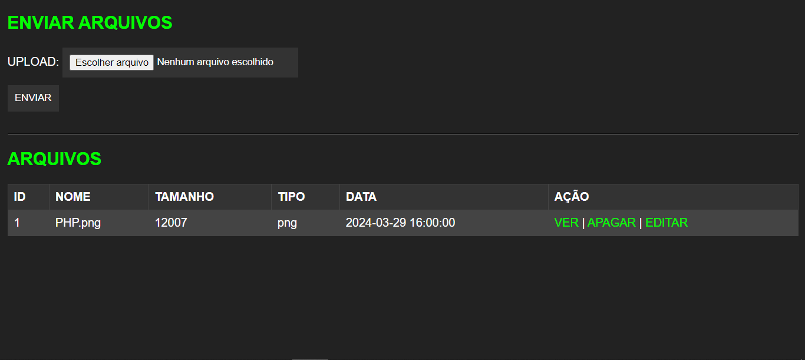
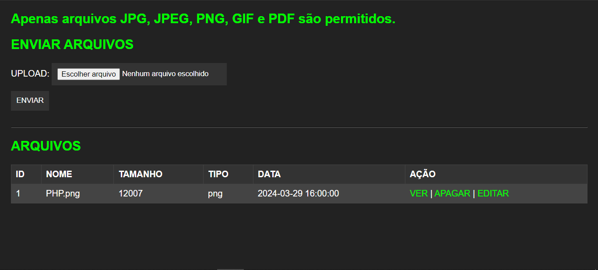
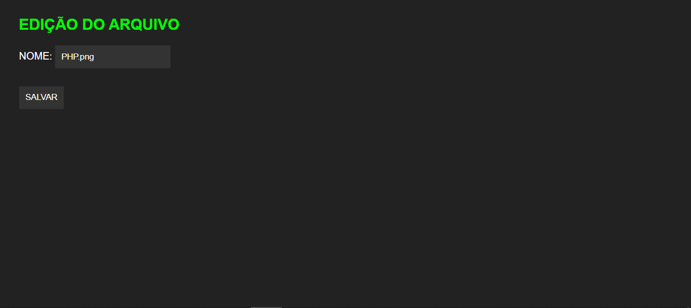
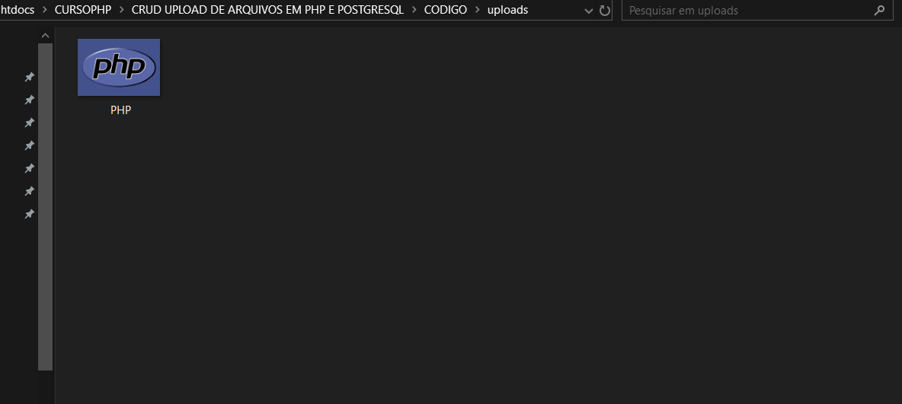

# CRUD UPLOAD DE ARQUIVOS EM PHP E POSTGRESQL
👨‍🏫CRUD DE MULTIMIDIAS EM HTML, CSS, PHP E POSTGRESQL.

 <br> <br> 
 <br> <br>
 <br> <br>
 <br> <br>
 <br> <br>
 <br> 

## DESCRIÇÃO:
O aplicativo CRUD de upload de arquivos em PHP e POSTGRESQL é uma ferramenta simples, mas poderosa, que permite aos usuários gerenciar facilmente o armazenamento e a manipulação de arquivos em um sistema web. Com este aplicativo, os usuários podem realizar uma variedade de tarefas relacionadas a arquivos, incluindo upload, visualização, edição e exclusão, tudo através de uma interface amigável e intuitiva:

1. **Upload de Arquivos**:
   - Os usuários podem fazer upload de arquivos para o sistema através de um formulário na página principal do aplicativo.
   - O formulário inclui um campo de seleção de arquivo que permite aos usuários escolher o arquivo desejado em seu dispositivo local.
   - Após o envio do arquivo, ele é transferido para o servidor e armazenado em um diretório específico, enquanto os detalhes do arquivo (como nome, tamanho e tipo) são registrados no banco de dados Postgresql.

2. **Listagem de Arquivos**:
   - Todos os arquivos que foram enviados para o sistema são listados em uma tabela na página principal do aplicativo.
   - A tabela exibe detalhes importantes de cada arquivo, como ID, nome, tamanho, tipo e data de upload.
   - Os usuários podem visualizar rapidamente todos os arquivos que foram enviados e suas informações associadas.

3. **Visualização de Arquivos**:
   - Os usuários têm a opção de visualizar arquivos individualmente clicando em um link de visualização ao lado de cada arquivo na tabela.
   - Ao clicar no link, os usuários podem ver uma visualização do arquivo (por exemplo, uma imagem) na mesma página ou em uma nova janela, dependendo do tipo de arquivo.

4. **Edição de Arquivos**:
   - Os usuários podem editar os detalhes dos arquivos, como nome, diretamente na tabela de listagem de arquivos.
   - Isso é possível através de um link de edição ao lado de cada arquivo, que redireciona os usuários para uma página de edição específica.

5. **Exclusão de Arquivos**:
   - Os usuários têm a capacidade de excluir arquivos do sistema clicando em um link de exclusão ao lado de cada arquivo na tabela.
   - Ao clicar no link, uma confirmação pode ser solicitada para evitar exclusões acidentais. Depois de confirmada, a exclusão do arquivo é realizada.

6. **Interface Responsiva**:
   - A interface do aplicativo é projetada para ser responsiva, garantindo uma experiência de usuário consistente em diferentes dispositivos e tamanhos de tela.
   - Elementos de design são adaptáveis e organizados de forma a facilitar a navegação e a interação do usuário.

Esses recursos combinados proporcionam aos usuários uma maneira eficiente de fazer upload, gerenciar e manipular arquivos dentro do sistema, permitindo uma experiência de usuário intuitiva e fácil de usar.

## EXECUTANDO O PROJETO:
1. **Importar o `DATABASE.sql`**
   - Como você já baixou esse projeto com uma foto de modelo dentro de `CODIGO/uploads/PHP.png`, é de suma importância que você import o arquivo `DATABASE.sql`.

2. **Configuração do PHP:**
   - Abra o arquivo `config.php` e ajuste as configurações do banco de dados:

     ```php
     $host = "localhost";
     $port = "5432"; 
     $dbname = "UPLOAD";
     $user = "seu_user";
     $password = "sua_senha";
     ```

3. **Executando o Aplicativo:**
   - Coloque os arquivos em um servidor web compatível com PHP (por exemplo, XAMPP, WAMP, LAMP).
   - Acesse o formulário no navegador visitando `http://localhost/CODIGO/index.php`.

## NÃO SABE?
- Entendemos que para manipular arquivos em `HTML`, `CSS` e outras linguagens relacionadas, é necessário possuir conhecimento nessas áreas. Para auxiliar nesse aprendizado, oferecemos cursos gratuitos disponíveis:
* [CURSO DE HTML E CSS](https://github.com/VILHALVA/CURSO-DE-HTML-E-CSS)
* [CURSO DE PHP](https://github.com/VILHALVA/CURSO-DE-PHP)
* [CURSO DE POSTGRESQL](https://github.com/VILHALVA/CURSO-DE-POSTGRESQL)
* [CONFIRA MAIS CURSOS](https://github.com/VILHALVA?tab=repositories&q=+topic:CURSO)

## CREDITOS:
- [PROJETO CRIADO PELO VILHALVA](https://github.com/VILHALVA)
- [PROJETO BASEADO NO "CRUD UPLOAD DE ARQUIVOS EM PHP"](https://github.com/VILHALVA/CRUD-UPLOAD-DE-ARQUIVOS-EM-PHP)


